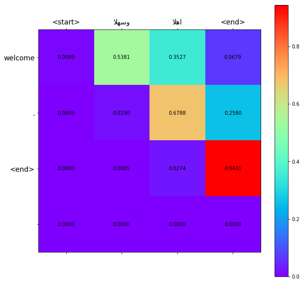

# Google's Neural Machine Translation with Attention from Arabic to English

#### Requirements:
- Python 3.5+
- Tensorflow 2.0
- NumPy
- bidi-python
- arabic_reshaper
- unicodedata

#### Introduction
Google Neural Machine Translation system (GNMT), which utilizes state-of-the-art training techniques to achieve the largest improvements to date for machine translation quality.

#### Previous work
A few years ago we started using Recurrent Neural Networks (RNNs) to directly learn the mapping between an input sequence (e.g. a sentence in one language) to an output sequence (that same sentence in another language) [2]. Whereas Phrase-Based Machine Translation (PBMT) breaks an input sentence into words and phrases to be translated largely independently, Neural Machine Translation (NMT) considers the entire input sentence as a unit for translation.The advantage of this approach is that it requires fewer engineering design choices than previous Phrase-Based translation systems. When it first came out, NMT showed equivalent accuracy with existing Phrase-Based translation systems on modest-sized public benchmark data sets.

#### Background on Neural Machine Translation

Back in the old days, traditional phrase-based translation systems performed
their task by breaking up source sentences into multiple chunks and then
translated them phrase-by-phrase. This led to disfluency in the translation
outputs and was not quite like how we, humans, translate. We read the entire
source sentence, understand its meaning, and then produce a translation. Neural
Machine Translation (NMT) mimics that!

Figure 1. <b>Encoder-decoder architecture</b> – example of a general approach for
NMT.

Specifically, an NMT system first reads the source sentence using an *encoder*
to build
a
["thought" vector](https://www.theguardian.com/science/2015/may/21/google-a-step-closer-to-developing-machines-with-human-like-intelligence),
a sequence of numbers that represents the sentence meaning; a *decoder*, then,
processes the sentence vector to emit a translation, as illustrated in
Figure 1. 

This is often referred to as the *encoder-decoder architecture*. In
this manner, NMT addresses the local translation problem in the traditional
phrase-based approach: it can capture *long-range dependencies* in languages,
e.g., gender agreements; syntax structures; etc., and produce much more fluent
translations as demonstrated
by
[Google Neural Machine Translation systems](https://research.googleblog.com/2016/09/a-neural-network-for-machine.html).

#### GNMT Architecture
The following visualization shows the progression of GNMT as it translates a Chinese sentence to English. First, the network encodes the Chinese words as a list of vectors, where each vector represents the meaning of all words read so far (“Encoder”). 

Once the entire sentence is read, the decoder begins, generating the English sentence one word at a time (“Decoder”). 

To generate the translated word at each step, the decoder pays attention to a weighted distribution over the encoded Chinese vectors most relevant to generate the English word (“Attention”; the blue link transparency represents how much the decoder pays attention to an encoded word).

#### Correlation Matrix

#### References
1- [Google's Neural Machine Translation System: Bridging the Gap between Human and Machine Translation](https://arxiv.org/abs/1609.08144)

2- [Sequence to Sequence Learning with Neural Networks](https://arxiv.org/abs/1409.3215)

3- [Addressing the rare word problem in neural machine translation](https://arxiv.org/abs/1410.8206)

4- [Neural Machine Translation of Rare Words with Subword Units](http://arxiv.org/abs/1508.07909)